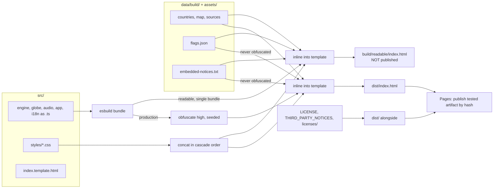
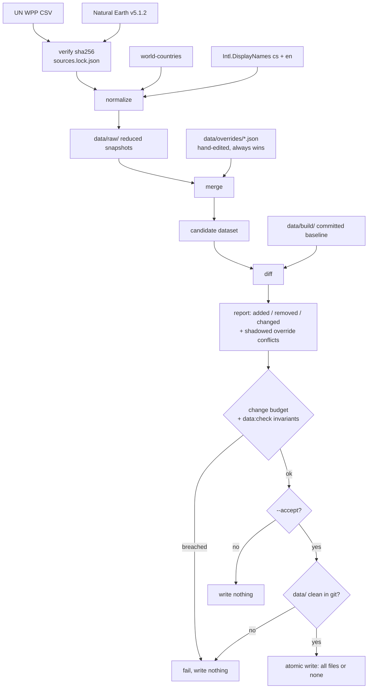
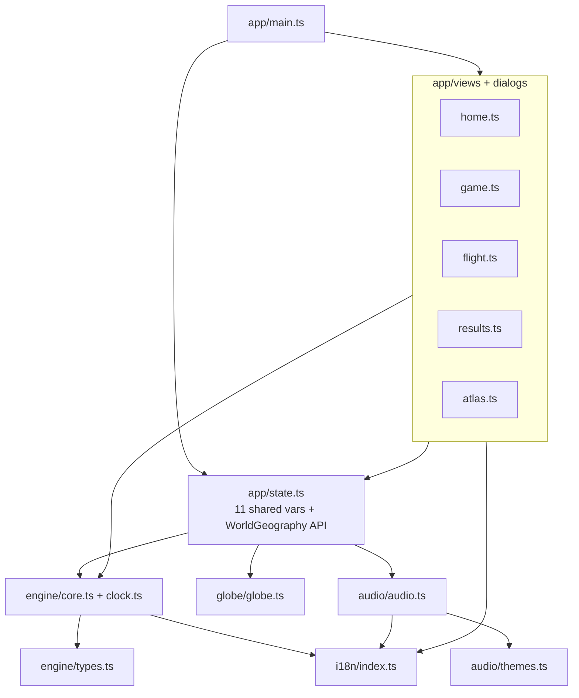

# World Geography Node Project - Plan

## Goal Capsule

- **Objective:** Turn the single 1.9 MB `World-Geography-v7.html` into a strict-TypeScript Node project with separated components, a data-refresh command, a bilingual (cs/en) UI, and two build flavors — one obfuscated file for GitHub Pages, one readable file for debugging.
- **Authority hierarchy:** Current v7 runtime behavior wins over any refactor convenience. Within that, R-IDs win on product behavior; KTD-IDs win on implementation mechanism. Licence and attribution requirements (R21, R22, R26) are non-negotiable and override size and obfuscation goals.
- **Execution profile:** Fidelity-gated, and the gates are captured before the code they protect is touched. U2 must reproduce sha256 `e4c7343e6321f0de4a2f1c1068890c525e28e602885db25896574b4db46b846d`. U3 captures four fixtures from the original JavaScript — questions, full run traces, real saved runs, and audio digests — while `original-source/` still exists. Those fixtures, not byte-identity, carry fidelity from U4 onward.
- **Stop conditions:** Stop and ask if (a) the byte-identity gate in U2 cannot be met, (b) a golden fixture diverges after a conversion unit and the cause is not one of the two permitted divergence classes named in KTD2, (c) an upstream data source is unreachable or has changed shape, (d) obfuscation measurably degrades globe or audio timing, or (e) the `world-countries` licence review (RISK-1) concludes ODbL share-alike is unacceptable.
- **Tail ownership:** This plan owns implementation through a green CI run and a working Pages deploy. It does not own the English copy review (U17) — that is a hand-off to the user.

---

## Product Contract

### Summary

Rebuild the Codex-generated World Geography source tree as a Node 24 / TypeScript project. The five `src/*.js` modules become typed ES modules decomposed into components; `scripts/build.py` and `scripts/prepare_data.py` become TypeScript commands; the Python Playwright tests become `@playwright/test` specs. No Python remains. Three commands drive the project: `npm run data:refresh` fetches upstream reference data and merges a hand-editable override layer over it, `npm run build:readable` emits a legible single-file HTML, and `npm run build` emits an obfuscated one. A cs/en language switcher with browser-language detection is added. The game's behavior, scoring, audio, and Czech copy are unchanged.

### Problem Frame

Codex delivered the game as a single compiled HTML file plus a source tree that only builds through Python. That shape blocks three things. Component-level work is impractical when `app.js` is 374 dense lines carrying every view, and when `style.css` holds ~250 rules on one 15,229-character line. Data cannot be refreshed on this machine at all — `countryinfo`, `babel`, `pycountry` and `pyogrio` are absent. And the hand-curation that makes the quiz correct (roughly 310 entries across nine tables, covering ~60 distinct countries' capitals, languages, currencies, regions, positions and geopolitical notes) is fused into a Python script as dict literals, so adjusting a politically sensitive call means editing code.

A fourth gap sits underneath: the JS tests exercise `src/`, the Python tests exercise the built `index.html`, and nothing proves those are the same code.

### Key Decisions

- **Curation is configuration, not code.** The override tables become hand-editable JSON that always wins over fetched data, because territorial and capital-status calls (Crimea, Kosovo, Jerusalem, Western Sahara) are editorial positions the maintainer must set directly. (session-settled: user-directed — chosen over full re-derivation from upstream: rule-based derivation cannot express an editorial position.) Governs R8, R9, R10, R11.
- **Overrides reach map geometry at polygon granularity.** Whole Natural Earth polygons can be reassigned or dropped; individual coordinates cannot be hand-edited. (session-settled: user-directed — chosen over tabular-only overrides: disputed-territory display is a first-class requirement; chosen over full geometry editing: hand-maintained GeoJSON is unsustainable.) Governs R12.
- **v7 behavior is the specification.** No change to scoring, question generation, audio, choreography, or Czech copy. Governs R1, R2, R15, R23.
- **Obfuscation targets reconstruction by a reading agent, not theft.** The stated goal is that the shipped file be hard for an AI to reconstruct into intelligible source. (session-settled: user-directed — chosen over standard-strength minification and over shipping readable: the user asked for obfuscation "that will be hard for AI to reconstruct".) This caps the effort at one high-strength pass: it is met when the bundle yields no recoverable identifier or control flow. It is **not** a claim about protecting the curated data, which ships as plain JSON by design and is the more valuable asset — and it protects nothing at all if the source repository is public. Governs R7.
- **English ships on stated demand and is deliberately not measured.** (session-settled: user-directed — chosen over adding Google Analytics: GA is a runtime network request that R8 forbids, R24 fails the build on, and the game's own footer and `<noscript>` text deny to players.) The offline guarantee and the on-screen claims stay intact; there is no signal telling anyone whether the second locale is used, and that is accepted. Governs R8, R15, R24.
- **Both locales ship in one HTML.** A second locale costs ~45 KB raw / ~10 KB gzip against a 1.29 MB gzip baseline — 0.8% — so per-language builds are not warranted and the offline single-file guarantee is preserved. Governs R20.

### Requirements

**Project structure and migration**

- R1. The project builds and runs entirely from Node 24 and npm, with no Python file in the repository.
- R2. Everything the project needs is copied out of `original-source/` so that directory can be deleted without loss.
- R3. Non-test artifacts scattered across `tests/`, `data/` and the repository root — the demo mp3, the simulation report, the hand-written test report, the media render script, the Monte Carlo simulator, and the provenance records `audit.txt`, `population_2026.txt` and `manifest-sha256.json` — move to `docs/` or `scripts/` per their role.
- R4. Generated, disposable artifacts — screenshots, run logs, and all self-reported results JSON except `simulation-results.json`, which is retained under `docs/data/` as the report `SIMULACE_CZ.md` cites — are not committed.
- R5. All source is TypeScript under `strict: true`, with a typed data model covering Country, Question, GameState, RunState, and the locale catalog.

**Build system**

- R6. `npm run build:readable` emits a self-contained readable single-file HTML, outside the published directory.
- R7. `npm run build` emits `dist/index.html`: one self-contained file with the code obfuscated. This is the only game HTML GitHub Pages serves; the only other published HTML is `404.html`.
- R8. Neither build emits any runtime network request, external stylesheet, font, image, or script. The game works from `file://`.

**Data pipeline and curation**

- R9. `npm run data:refresh` fetches upstream reference data, merges the override layer over it, and writes a diff report against the committed baseline without modifying it.
- R10. `npm run data:refresh --accept` writes the merged result atomically — all files or none.
- R11. The override layer is hand-editable JSON covering country fields, per-locale text, language and currency lists, region assignment, the `easy` flag, and geopolitical notes. Override values always win over fetched values, and every upstream change an override suppressed is reported.
- R12. The override layer can reassign a Natural Earth polygon from one country to another, or drop it. A rule matching zero or more than one polygon fails with a message naming the rule.
- R13. Population data comes from the UN World Population Prospects CSV.
- R14. `npm run data:flags` regenerates the 195 flag PNGs from a pinned Noto Color Emoji release. Neither `build` nor `data:refresh` invokes it; the committed PNGs are the source of truth.
- R28. `npm run data:check` asserts data invariants on the committed dataset independently of any diff, and runs in CI.

**Internationalization**

- R15. The UI is available in Czech and English. Czech output is byte-identical to today's.
- R16. Language is detected from `navigator.languages` on first visit, overridable by an in-app switcher, and persisted.
- R17. Country, capital, language, and currency names in English are generated from `Intl.DisplayNames` and reviewed through the same override layer as Czech.
- R18. Question generation produces exactly one correct answer in both locales. Distractor-exclusion lists, currency unit names, and population labels are per-locale and swap atomically.
- R19. A saved run carries its locale. A run created in one language is not resumed under another.
- R20. Both locales are embedded in the single output HTML.
- R29. A saved run written by the shipped v7 build resumes after deploy.

**Licensing and attribution**

- R21. The embedded licence notices remain plain, unobfuscated, uncompressed text, reachable from the "Data & zdroje" dialog.
- R22. `LICENSE`, `THIRD_PARTY_NOTICES.txt` and `licenses/` ship with the distribution. No font file is distributed.
- R26. The published site serves the licence files at the paths the embedded notices name, and the notices name only sources the code actually uses.

**Testing and delivery**

- R23. The ported test suite proves the TypeScript engine reproduces the original JavaScript engine's questions, run traces, and audio, and still accepts real v7 saved runs.
- R24. A headless-browser suite runs against the obfuscated build and asserts no network request is made.
- R25. Pushing to `main` deploys to GitHub Pages.
- R27. The bytes deployed are the bytes tested — the deploy publishes the CI-produced artifact, verified by hash.

### Scope Boundaries

**In scope:** the repackaging, the TypeScript conversion, the data pipeline, the language switcher, the CSS split, the test port, CI and Pages deployment.

**Out of scope — v7 behavior is frozen:** scoring formula, time limits, life economy, question categories, globe choreography timings, the 21 synthesized audio themes, and all existing Czech copy.

**Deferred to follow-up work:**
- Golden-image visual regression. The Playwright port gives the capability; populating baselines is separate work.
- Firefox and WebKit coverage. Chromium-only today, and this plan does not widen it. R16's `navigator.languages` detection is a new cross-browser surface that stays unverified there.
- A third locale. The catalog and data model must not preclude one, but nothing is built for it.

**Outside this project's identity:** any runtime network fetch, analytics, advertising, remote fonts, or a hosted data service. The game is offline-first and self-contained; that is the product.

### Success Criteria

- `original-source/` can be deleted and every command still works.
- A maintainer can change a disputed capital or reassign a territory by editing one JSON file, with no TypeScript change.
- The obfuscated build holds 60 fps on the globe and produces no audible audio artifacts.
- A player who had a game in progress before the deploy resumes it afterwards.
- A player whose browser advertises only English plays a full game with no Czech string visible and no untranslated geopolitical note.
- `dist/index.html` yields no recoverable engine identifier or readable control flow, and stays within the timing budget in the Goal Capsule stop conditions.

### Sources

- Build reproducibility, template markers, and the notices chain: `original-source/scripts/build.py`, `original-source/src/index.template.html`, `original-source/THIRD_PARTY_NOTICES.txt`.
- The complete curation inventory to be extracted: `original-source/scripts/prepare_data.py` — `capital_names`, `cap_overrides`, `notes`, `lang_overrides`, `currency_overrides`, `lang_names`, `name_overrides`, `coords`, `extra`, and the inline region and `easy` rules.
- Locale-coupled correctness risk: `original-source/src/core.js` `SPECIAL_CAPITALS` (:11-22), `uniqueWrong` (:46-48), `currencyLabel` (:33-38), `populationLabel` (:26-32).
- Stateful engine surface the question fixture does not reach: `core.js` `nextCountry` (:114-123), `appendQuestion` (:186-203), `spendCountryAttempt` (:133), `awardPoints` (:137-150), `submit`/`advance` (:227-257), `validateProgress` (:260-282).
- Test seam that constrains decomposition: `original-source/src/app.js:19` (the shared mutable state line) and `:368` (`window.WorldGeography`).
- UN WPP CSV: `https://population.un.org/wpp/assets/Excel%20Files/1_Indicator%20(Standard)/CSV_FILES/WPP2024_Demographic_Indicators_Medium.csv.gz`. The Data Portal REST API returns 401 without a token and is unusable for unattended builds.
- Natural Earth: `https://raw.githubusercontent.com/nvkelso/natural-earth-vector/v5.1.2/geojson/ne_110m_admin_0_countries.geojson`, 838,726 bytes, public domain.
- `world-countries` licence: code MIT, **data ODC-ODbL 1.0** — verified against the project's LICENSE file. See RISK-1.
- Obfuscator exclusion semantics: conditional comments do not stop child AST transformations, and `reservedNames` prevents renaming only. Separate obfuscation runs are the only real carve-out.

---

## Planning Contract

### Key Technical Decisions

- KTD1. **Verification moves down a ladder as fidelity anchors are consumed.** Byte-identity proves the build port only, against a frozen copy of the original sources. From U4 the golden fixtures carry fidelity. The ladder has a rung at each conversion boundary, and a final rung that runs the fixtures through the *shipped* artifact — otherwise the obfuscator sits outside every gate. Governs R23, R27.
- KTD2. **Four fixtures, captured from the original JavaScript before anything is converted.** Question generation alone does not pin v7. `questions-golden.json` holds the 14,040 `makeQuestion` variants. `runs-golden.json` drives `makeGame` → `submit` → `advance` to completion across the 48 simulation configurations and serializes the game object plus every `submit` return after each step — this is what pins RNG consumption order, the life ledger, and scoring. `runs/*.json` holds three to five real `wg.run.v7` payloads lifted from the shipped build. `audio-golden.json` holds a per-theme spectral digest rendered through `OfflineAudioContext`. All four must be captured while `original-source/` exists.
  - **Three permitted divergence classes**, to be diagnosed rather than assumed to be port defects: ICU number formatting inside `populationLabel`; ordering among equidistant countries in `distance()`; and **Node ICU against Chromium ICU when a fixture is replayed in a browser** — Node renders `cs-CZ` thousands with U+00A0 (verified) while Chromium has historically used U+202F, so `golden-dist` normalizes Unicode space separators before comparing and asserts them separately against the browser's own `toLocaleString`. Without that carve-out the one gate covering the shipped bundle reddens on a correct build and gets disabled as flaky. Both follow from `toLocaleString('cs-CZ')` and `Math.acos` being implementation-approximated, so the fixture encodes one Node build. Pin the exact Node version in `.nvmrc` and CI. Everything else that diverges is a defect.
- KTD3. **esbuild plus a small inliner, not Vite or Rollup.** `selfDefending` forbids any edit after obfuscation, so the order — bundle, minify, obfuscate, inline — must be explicit and under direct control. esbuild escapes `</script>` in its output. Use `charset: 'utf8'` or Czech strings inflate into `\uXXXX`. Use `replaceAll` with the **function** form of the replacement, or `$&` and `` $` `` in obfuscated output corrupt the result and only the first marker is substituted.
- KTD4. **One high-strength obfuscation pass over one bundle.** (session-settled: user-directed — chosen over a hot/cold split that kept aggressive transforms off the render loop: the objective is that the file not read as source, and a single pass meets it at a fraction of the complexity.) There is no module partition, no reserved cross-bundle global, no metafile assertion, and no duplicated-module hazard.
  - **The cost is real and lands on the hot paths.** The globe's `requestAnimationFrame` loop and the Web Audio scheduler now carry control-flow flattening and dead-code injection, which the obfuscator documents at up to 1.5x slower for flattening alone. This is the exposure the split existed to avoid, accepted deliberately. U13 measures `update`+`draw` cost and audio note counts against the readable build; if the budget in the Goal Capsule stop conditions is breached, **lower the global strength** — do not reintroduce the split.
  - Because there is one bundle, `src/i18n` may be imported anywhere, including by `audio/`. The theme names need no `translate` callback.
- KTD5. **No compression of embedded artifacts.** (session-settled: user-directed — chosen over deflate+base64 encoding of text artifacts: measured, it saves 312 KB on disk but costs ~29 KB of brotli transfer and does not impede reconstruction.) Measured: plain 2,035,646 B file / 1,250,593 B brotli; compressed-except-flags 1,723,999 B / 1,279,994 B. Flag data compresses 1% because PNG is already deflated. Governs R7, R21.
- KTD6. **The 1.5 MB flag payload stays out of the obfuscated JavaScript.** With `splitStrings` at chunk length 5 it would become roughly 380,000 fragments; with `stringArrayEncoding: ['rc4']` it would RC4-decode megabytes at boot. It is emitted as a separate plain `<script type="application/json">` block, as today. Governs R7, R8.
- KTD7. **Zero runtime dependencies; `Intl.DisplayNames` replaces Babel and CLDR.** Node 24 ships full ICU and supplies region, currency and language names in both locales — verified: `CZ → Česko / Czechia`, `CZK → česká koruna`, `cs → čeština / Czech`. The only alternative giving both locales' currency *and* language names is the cldr-json pair at 64 MB. Governs R17.
- KTD8. **`world-countries` is the one data devDependency, and it carries a share-alike obligation.** It supplies what `Intl` cannot: English capital names, `latlng` seed positions, and `cca2`/`cca3`/`ccn3` conversion. Its `borders` adjacency graph and `area` are **not** consumed — `countries.json` carries neither field (verified) and no requirement asks for them — so dropping the package costs English capitals plus a static ISO code table, not a graph. Its **data is ODC-ODbL 1.0**, not MIT — verified. `data/build/countries.json` becomes a derived database, which is a different obligation from the MIT / Unicode-3.0 / OFL-1.1 / Apache-2.0 set currently embedded. See RISK-1; resolve before U9 lands.
- KTD9. **Natural Earth ISO3 resolution is `ISO_A3_EH` with `ADM0_A3` fallback.** `ISO_A3` is `-99` for Norway, France, Northern Cyprus, Somaliland and Kosovo. `ISO_A3_EH` fixes Norway and France — exactly the two the Python script hardcoded. The remaining three are disputed territories and resolve through the override layer, which is where they belong. Governs R12.
- KTD10. **The shared store owns eleven variables, not five.** Verified against `app.js:13` and `app.js:19` — `options` is declared and normalized at :13-18, the other ten sit on the single `let` at :19. The store owns `game`, `view`, `phase`, `options`, `lastGlobeCode`, `record`, `selected`, `revealToken`, `flightKey`, `clock` and `clockIndex`, plus the `globe` and `audio` instances. `clock` and `clockIndex` are **not** game-view-local — `window.WorldGeography.getStatus()` reads both, so the debug API cannot be built without them in the store. `revealToken` and `flightKey` are the cancellation tokens for a 12-second async choreography and must stay reachable from `leaveGame`, or a stale reveal fires after the player navigates away. Genuinely local, and correctly excluded: `atlasCode`, `atlasQuery`, `atlasRegion`, `clockRAF`, `lastTickSecond`, `startingClock`, `lastPersist`, `toastTimer`, `storageWarningShown`, `musicPreviewSerial`. Governs R5.
- KTD11. **Flatten the entangled CSS selectors, then split by component.** (session-settled: user-directed — chosen over wrapping the historical layers in `@layer`: layering is safe but leaves `.canvas-wrap` defined in three files, so readability barely improves.) Measured: 362 distinct selectors, 35 styled across two or more layers, 10 `!important` declarations. Equivalence is proven by computed-style diffing across every view and interaction state, not by inspection. Governs R5.
- KTD12. **Per-locale question data is swapped atomically or not at all.** `SPECIAL_CAPITALS.exclude`, `CURRENCY_UNITS` values, and `populationLabel` suffixes each feed string-equality distractor filtering. A partial swap yields questions with two correct answers. The type system enforces this: a question is generated from a single `LocaleBundle`, never from loose strings. Governs R18.
- KTD13. **Locale is part of run identity, and a v7 save predates it.** A saved run bakes `prompt`, `options[]` and `explanation` as resolved strings, and `isValidRun` checks only "three distinct strings", so a language switch mid-run silently renders mixed-language questions. The run record gains `lang`, and `isValidRun` rejects a mismatch — but a run written by the shipped v7 build has **no** `lang` field, and detection defaults to English when the browser does not advertise Czech. A missing `lang` is therefore migrated to `cs` **and pins the session locale to `cs`** for that session (persisting nothing; the switcher stays available). Without the pin the two rules cancel out: detection picks English, migration writes `cs`, and the mismatch check discards exactly the save the migration exists to protect. Stored objects gain a `schemaVersion` so the next change has a migration point. Governs R19, R29.
- KTD14. **Flag regeneration renders through `@napi-rs/canvas` with a pinned font, downloaded not committed.** Verified reproducing the committed geometry exactly, including Nepal at 90×87 and Switzerland at 98×94. The font is Noto Color Emoji 2.051 / `noto-emoji:20250818`, the version `THIRD_PARTY_NOTICES.txt` credits. Output is visually equivalent but not byte-identical, so the command warns before overwriting. A `--font-path` flag accepts a local copy for when the URL dies. Governs R14, R22.
- KTD15. **Both locales live in one dataset, not two.** Language-varying fields on `Country` become `LocalizedText` objects (`{cs, en}`) inside a single `countries.json`, rather than parallel per-locale files or per-language builds. Cost of the second locale: ~45 KB raw / ~10 KB gzip against a 1.29 MB baseline. This keeps one build artifact, keeps the switcher instant with no fetch, and makes a missing translation a type error. Governs R17, R20.
- KTD16. **Every build-time download is content-pinned, not just version-pinned.** A git tag can be force-moved, a GitHub release asset can be retagged, and the UN republishes WPP revisions in place — same URL, same shape, different numbers. Each fetch records resolved URL, sha256 and byte length in `data/raw/sources.lock.json`, and a hash change fails without `--accept-source-change`. This restores the habit the discarded `manifest-sha256.json` already showed the project had. Governs R9, R13, R14.
- KTD17. **The refresh is guarded by invariants and a change budget, not by a human reading a diff.** `data:check` asserts absolute invariants in CI. The refresh fails without `--accept-large` when any curated field changes at all, or when more than a threshold of countries change a non-population field. The report also lists **shadowed** changes — every upstream correction an override suppressed — because otherwise the geopolitical overrides rot silently, and those are exactly the entries most likely to move. Governs R11, R28.
- KTD18. **Deploy publishes the artifact CI tested, and only the obfuscated one.** The obfuscator randomizes by default, so an unseeded rebuild produces different bytes than the ones tested; pin `seed` in both configs *and* pass the artifact through rather than rebuilding. The readable build is written outside the published directory — publishing it beside `dist/index.html` would defeat R7 entirely. Governs R6, R7, R27.

### High-Level Technical Design

**Build pipeline — two flavors, one published.**



**Data refresh — fetched data never wins, and never ships unguarded.**



**Module topology after decomposition.** Arrows point from consumer to dependency. One bundle, so every edge is an ordinary ES import.



### Assumptions

- The UN WPP `Demographic_Indicators_Medium` CSV keeps its `TPopulation1July` column and thousands unit. `data:check` catches a unit change as a 1000× population shift; the fetcher stops rather than guessing.
- GitHub Pages serves brotli, which is why KTD5 measures against brotli rather than gzip.
- `npm run build` and `build:readable` are fully offline. `data:refresh` and `data:flags` require network unless given local paths.
- Byte-identity in U2 is data-conditional: it holds because the current JSON contains no integral-float values (`20.0`) and no exponent forms — verified, zero occurrences. Python emits `20.0` where JS emits `20`, so U9's coordinate rounding could reintroduce them.
- The user reviews generated English names (U17) before the first bilingual release. The plan produces the review artifact, not the reviewed result.

### Sequencing

Execution order is not U-ID order. Four hard constraints; everything else is dependency-driven:

1. **U3 before U4.** All four fixtures must be captured from the original JavaScript while it still exists.
2. **U2 before any source edit**, and U2 reads only from `tests/fixtures/baseline/` so it stays green permanently instead of rotting when U12 and U13 change the live template and data.
3. **U15 before U6, U7, U11 and U16.** Those units' verification needs a working bundler and dev server, which the U2 concatenator cannot provide once sources are TypeScript modules.
4. **RISK-1 resolved before U9 lands.** The `world-countries` ODbL question changes what the notices must say.

**Order:** U1 → U2 → U3 → U4 → U15 → U5 → U6 → U16 → U7 → U8 → U9 → U10 → U11 → U12 → U17 → U13 → U14.

---

## Output Structure

```
.
├── package.json  package-lock.json  tsconfig.json  .nvmrc
│     scripts: build, build:readable, dev, data:{refresh,apply,check,flags},
│              test, test:browser, typecheck, verify:baseline, simulate
├── vitest.config.ts  playwright.config.ts  .gitignore
├── obfuscator.json                             # one-line rationale per non-default option
├── LICENSE  THIRD_PARTY_NOTICES.txt  README.md
├── licenses/{Apache-2.0.txt,Noto-Emoji-NOTICE.txt,ODbL-1.0.txt}
├── src/
│   ├── index.template.html
│   ├── engine/{core.ts,clock.ts,types.ts}          # DOM-free, golden-fixture contract
│   ├── globe/globe.ts
│   ├── audio/{audio.ts,themes.ts}
│   ├── i18n/{index.ts,cs.ts,en.ts,plurals.ts}
│   ├── app/
│   │   ├── main.ts  state.ts  storage.ts
│   │   ├── views/{home,game,flight,results,atlas}.ts
│   │   ├── dialogs/{help,sources,audio-settings}.ts
│   │   └── mobile-hud.ts
│   └── styles/{tokens,base,header,globe,panel,question,results,atlas,dialog,mobile}.css
├── data/
│   ├── build/{countries,map,sources,flags}.json    # generated + committed: the baseline
│   ├── overrides/                                  # hand-edited, always wins
│   │   ├── {capitals,languages,currencies,regions,easy,coords,territory}.json
│   │   └── {countries,notes}.{cs,en}.json
│   ├── raw/  + sources.lock.json                   # reduced snapshots + content hashes
│   └── embedded-notices.txt
├── assets/flags/*.png                              # 195 committed PNGs
├── scripts/
│   ├── build.ts  dev.ts  obfuscate.ts  simulate.ts  render-audio.ts
│   ├── capture-golden.ts
│   └── data/{refresh,check,flags,merge,diff}.ts  data/fetchers/*.ts
├── tests/
│   ├── unit/*.test.ts
│   ├── browser/*.spec.ts
│   └── fixtures/
│       ├── baseline/                               # frozen inputs for the U2 hash gate
│       │   ├── v7-index.html  style.css  index.template.html
│       │   ├── js/*.js  data/*.json  embedded-notices.txt
│       │   └── runs/*.json                         # real wg.run.v7 payloads
│       ├── questions-golden.json  runs-golden.json  audio-golden.json
│       └── computed-styles.json
├── docs/
│   ├── media/answering-music.mp3
│   ├── provenance/{audit.txt,population_2026.txt,manifest-sha256.json}
│   ├── {HUDBA,SIMULACE,CHANGELOG}_CZ.md  TEST_REPORT_CZ.txt
│   └── plans/
├── build/readable/index.html                       # NOT published (gitignored)
└── dist/                                           # published to Pages
    ├── index.html  .nojekyll  404.html
    └── LICENSE  THIRD_PARTY_NOTICES.txt  licenses/
```

Per-unit `Files` lists remain authoritative; this tree is the shape, not a constraint.

---

## Implementation Units

### Unit Index

Rows are in execution order, not U-ID order.

| U-ID | Title | Key files | Depends on |
|---|---|---|---|
| U1 | Scaffold, asset rescue, baseline fixtures | `package.json`, `assets/flags/`, `tests/fixtures/baseline/` | — |
| U2 | Build port and byte-identity gate | `scripts/build.ts`, `tests/unit/build-baseline.test.ts` | U1 |
| U3 | Test harness and the four golden fixtures | `scripts/capture-golden.ts`, `tests/fixtures/*.json` | U1 |
| U4 | Engine to strict TypeScript | `src/engine/{core,clock,types}.ts` | U3 |
| U15 | Bundler build and dev server | `scripts/{build,dev}.ts`, `src/index.template.html` | U4 |
| U5 | Globe and audio to TypeScript | `src/globe/globe.ts`, `src/audio/*.ts` | U4 |
| U6 | Storage, shared store, low-entanglement extractions | `src/app/{state,storage}.ts`, `src/app/{dialogs,mobile-hud}` | U5, U15 |
| U16 | View decomposition and dispatcher | `src/app/views/*.ts`, `src/app/main.ts` | U6 |
| U7 | CSS flatten, split, computed-style equivalence | `src/styles/*.css`, `tests/browser/styles.spec.ts` | U15, U16 |
| U8 | Typed data model and override layer | `data/overrides/*.json`, `scripts/data/merge.ts` | U1 (types edit after U4) |
| U9 | Fetchers, merge, diff, invariants | `scripts/data/{refresh,check,diff}.ts` | U8, RISK-1 |
| U10 | Flag regeneration command | `scripts/data/flags.ts` | U1, U9 (`sources.lock.json`) |
| U11 | i18n runtime: catalog, plurals, detection, switcher | `src/i18n/`, `src/app/state.ts` | U15, U16 |
| U12 | Locale-safe engine and generated English data | `src/engine/core.ts`, `data/overrides/countries.en.json` | U9, U11 |
| U17 | English copy translation and review hand-off | `data/overrides/notes.en.json`, `data/build/sources.json` | U12 |
| U13 | Obfuscated build flavor | `scripts/obfuscate.ts`, `obfuscator.*.json` | U15, U12 |
| U14 | Browser suite, CI, Pages deploy | `tests/browser/`, `.github/workflows/` | U13 |

### U1. Scaffold, asset rescue, baseline fixtures

**Goal:** Stand up the Node project and copy everything worth keeping out of `original-source/`, including the frozen inputs the byte-identity gate needs.

**Requirements:** R1, R2, R3, R4, R5, R22

**Dependencies:** none

**Files:**
- Create: `package.json`, `package-lock.json`, `tsconfig.json`, `.nvmrc`, `.gitignore`, `README.md`
- Copy to live source: `original-source/src/index.template.html` → `src/index.template.html`; `original-source/src/style.css` → `src/style.css`
- Copy to frozen baseline (`tests/fixtures/baseline/`): `index.html` → `v7-index.html`; `src/*.js` → `js/`; `src/style.css`; `src/index.template.html`; `data/{countries,map,sources,flags}.json` → `data/`; `data/embedded-notices.txt`
- Copy to live data: `original-source/data/{countries,map,sources,flags}.json` → `data/build/`; `data/embedded-notices.txt` → `data/`
- Copy: `original-source/data/flags/*.png` → `assets/flags/` (195 files)
- Copy: `original-source/{LICENSE,THIRD_PARTY_NOTICES.txt}`, `original-source/licenses/*`
- Archive: `original-source/scripts/{build,prepare_data,prepare_flags}.py` → `docs/provenance/original-python/*.py.txt` — evidence, not runnable code. They are the specification U2, U8 and U10 transcribe from; without them the ~310 override entries have no origin to re-check against once `original-source/` is gone.
- Relocate to `docs/`: `answering-music-v6.mp3` → `docs/media/answering-music.mp3`; `{HUDBA,SIMULACE,CHANGELOG}_CZ.md`, `TEST_REPORT_CZ.txt`; `tests/simulation-results.json` → `docs/data/`; `data/audit.txt`, `data/population_2026.txt` and `manifest-sha256.json` (repo root, not `tests/`) → `docs/provenance/`
- Relocate to `scripts/`: `simulate.js` (ported in U3). `render_audio.js` is kept only if the deferred mp3 regeneration is taken up; otherwise discard it with the Python.
- Discard: `tests/screenshots/`, all `*-v7.log`, and the eight self-reported `*-results.json` files other than `simulation-results.json` (`audio-demo`, `browser-real`, `browser-virtual`, `core`, `final-ui`, `native-file`, `simulation-test`, `unchanged-assets`)

**Approach:**
1. `git init`; `.gitignore` covers `node_modules/`, `dist/`, `build/`, `test-results/`, `.cache/`, `.DS_Store`.
2. **`style.css` is a live build input, not just a fixture.** `build.py:7` substitutes it into the `CSS` marker; without it U2 cannot build at all.
3. The `tests/fixtures/baseline/` copies are frozen. U2 reads only from there, so its gate stays green after U12 and U13 change the live template and data.
4. `tsconfig.json`: `strict: true`, `target: ES2022`, `moduleResolution: bundler`, `noEmit`. `.nvmrc` pins the exact Node version per KTD2.
5. `package.json` declares the full script surface up front; unimplemented scripts exit non-zero naming their unit. Pin `javascript-obfuscator` and `@napi-rs/canvas` to exact versions, not `^`. Commit `package-lock.json`; CI uses `npm ci`.
6. devDependencies: `typescript`, `esbuild`, `vitest`, `@playwright/test`, `javascript-obfuscator`, `world-countries`, `@napi-rs/canvas`. No runtime dependencies.
7. `docs/provenance/` keeps the evidence trail behind claims the shipped notices still make. `manifest-sha256.json` is not a live gate but records what the original release contained.
8. Rewrite `README_CZ.md` as `README.md` for the Node workflow, carrying forward its honesty constraints — the `file://` limitation, and that Firefox, Safari and physical mobile devices were never verified.
9. Do not delete `original-source/`. U14 removes it.

**Test scenarios:**
- `assets/flags/` holds exactly 195 PNGs whose names match the 195 `code` values in `data/build/countries.json`.
- `tests/fixtures/baseline/` contains `style.css`, `index.template.html`, five `.js` files, four `.json` files, `embedded-notices.txt` and `v7-index.html`.
- `src/style.css` exists and is byte-identical to the baseline copy.
- No `.py` file exists under the repo root outside `original-source/` and `docs/provenance/original-python/` (archived as `.py.txt`, so R1's no-Python-in-the-build intent holds).
- `npm run <unimplemented>` exits non-zero naming the owning unit.
- `package.json` pins `javascript-obfuscator` and `@napi-rs/canvas` to exact versions.

**Verification:** `npm ci` succeeds; every baseline fixture is present; the repo contains no Python outside `original-source/`.

### U2. Build port and byte-identity gate

**Goal:** Reimplement `scripts/build.py` in TypeScript and prove it against the frozen baseline.

**Requirements:** R1, R8, R21

**Dependencies:** U1

**Execution note:** Write the hash assertion as a failing test first. This is the one point in the plan with an exact-match oracle.

**Files:**
- Create: `scripts/build.ts`, `tests/unit/build-baseline.test.ts`
- Read (frozen only): `tests/fixtures/baseline/{index.template.html,style.css,embedded-notices.txt}`, `baseline/js/*.js`, `baseline/data/*.json`

**Approach:**
1. Replicate the substitution contract exactly: markers `/*__TAG__*/`, replaced in insertion order NOTICES, CSS, CORE, CLOCK, AUDIO, GLOBE, APP, COUNTRIES, FLAGS, MAP, SOURCES.
2. **Normalize newlines explicitly.** Python's `read_text` opens in universal-newline mode, converting `\r\n` and lone `\r` to `\n` before substitution; `fs.readFileSync(f,'utf8')` does not. Every current input is pure LF, so the gate passes today — but it becomes environment-dependent under a Windows checkout or `core.autocrlf`.
3. Use `replaceAll` with the function form. JS `replace(string, string)` substitutes only the first occurrence where Python's `str.replace` substitutes all; each marker occurs once today, so this does not bite yet.
4. For `.json` inputs only, re-serialize with `JSON.stringify` then apply the `</` → `<\/` guard. Note the guard is currently a no-op — zero `</` sequences exist in any JSON input — so a passing gate is not evidence the guard works. Test it directly.
5. Non-JSON inputs concatenate raw. Add a guard that *errors* if any JS or CSS input contains `</script`. `app.js` holds 344 `</` sequences today and none is `</script`, so the invariant holds but is unenforced.
6. Fail if `/*__` survives substitution.
7. Assert sha256 `e4c7343e6321f0de4a2f1c1068890c525e28e602885db25896574b4db46b846d` at 1,990,211 bytes.

**Patterns to follow:** `original-source/scripts/build.py` is the specification.

**Test scenarios:**
- Building from the frozen baseline yields exactly sha256 `e4c7343e…b846d` and 1,990,211 bytes.
- Output is byte-identical to `tests/fixtures/baseline/v7-index.html`.
- An input containing `\r\n` produces the same output as the same input with `\n`.
- A template with an unreplaced `/*__FOO__*/` marker fails naming `FOO`.
- A template with a marker appearing twice substitutes both occurrences.
- A JS input containing `</script>` fails the build.
- A JSON value containing `</script>` is escaped to `<\/script>` and still round-trips through `JSON.parse`.
- A JSON value containing `$&` survives inlining unchanged.
- A JSON input containing an integral float (`20.0`) is detected and reported, since Python and JS serialize it differently.

**Verification:** `npm run verify:baseline` passes, and keeps passing for the life of the project because it reads only frozen fixtures.

### U3. Test harness and the four golden fixtures

**Goal:** Port the five `node:assert` suites to vitest and capture every fidelity fixture from the original JavaScript.

**Requirements:** R1, R4, R23

**Dependencies:** U1

**Execution note:** All four fixtures come from `tests/fixtures/baseline/js/` — the untouched original. Capture and commit them here; every later unit asserts against them.

**Files:**
- Create: `vitest.config.ts`, `playwright.config.ts`, `scripts/capture-golden.ts`
- Create: `tests/fixtures/{questions-golden.json,runs-golden.json,audio-golden.json}`, `tests/fixtures/baseline/runs/*.json`
- Create: `tests/unit/{core,timing,globe,audio,simulation}.test.ts`
- Port: `original-source/tests/simulate.js` → `scripts/simulate.ts`

**Approach:**
1. **`questions-golden.json`** — walk 3 difficulties × 4 seeds × 195 countries × 6 types in `core.test.js` order, serializing `{country, type, difficulty, seed, prompt, options, correct, explanation, source}`. This pins `makeQuestion` and nothing else.
2. **`runs-golden.json`** — the fixture that actually pins v7. For the 48 seed configurations `simulation.test.js` already uses, drive `makeGame` → `submit` → `advance` to completion, serializing a per-step sha256 of the canonically-serialized game object plus the full `submit` return, and the complete game object only at the terminal state. Hashing per step keeps the fixture linear rather than quadratic — re-serializing the growing `questions` array at every step across 48 runs would produce a multi-megabyte committed fixture that `golden.test.ts` deep-compares on every run, and the field most likely to be trimmed under that pressure is the one that matters. A changed step hash still names the step to bisect on. This is the only thing that catches a reordering of the three RNG consumers in `appendQuestion` (`core.js:186` derives one `random` and hands it to `nextCountry`, the bonus-pool pick, then `makeQuestion`) — a port that reorders them produces an identical question fixture and a different game.
3. **`tests/fixtures/baseline/runs/*.json`** — three to five real `wg.run.v7` payloads captured from the shipped build via Playwright: mid-country, mid-flight, pending-bonus, post-milestone. `validateProgress` compares stored answers field by field with `JSON.stringify`, so adding, removing or renaming any field on the result or question object silently rejects every player's save.
4. **`audio-golden.json`** — render each of the 21 themes through `OfflineAudioContext` and store a spectral digest. **Capture this in Playwright, not Node: `OfflineAudioContext` is a Web Audio API and is `undefined` in Node 24** — verified. Drive `tests/fixtures/baseline/v7-index.html` through the same Playwright harness this unit already uses for the real `wg.run.v7` payloads. Do not reach for a Node Web Audio polyfill: its synthesis would not match Chromium's, so the fixture would pin the wrong thing. Because the digest encodes one browser build, pin `@playwright/test` to an exact version alongside `.nvmrc`. Without this fixture U5 rewrites the entire synthesizer with no oracle at all.
5. Port each suite to vitest as `describe`/`it` blocks. Remove the three `writeFileSync` calls that write into the source tree; convert their counters to assertions.
6. Keep the `vm.createContext` loader as a helper for `globe` and `audio`; U5 deletes it.
7. `scripts/simulate.ts` stays a script — a 61-second Monte Carlo, never in CI. `tests/unit/simulation.test.ts` keeps the fast differential check and imports it as a module.

**Test scenarios:**
- `questions-golden.json` holds exactly 14,040 entries and regenerates deterministically across two runs.
- `runs-golden.json` covers all 48 configurations and each run reaches a terminal state.
- `runs-golden.json` is under 2 MB, asserted, so it cannot silently grow into a fixture someone trims.
- Every captured real run passes `isValidRun` and `validateProgress` against the baseline engine.
- `audio-golden.json` holds 21 theme digests.
- Ported `timing`: `pointsForTime(0,limit)` is 1000, `(limit/2)` is 550, `(limit)` is 0; monotonic and a multiple of 10 across 6,203 samples; `NaN` or negative elapsed throws.
- Ported `core`: `validateCountries` accepts the committed data and rejects a duplicate code, a missing capital, a bad region and a non-finite population.
- Ported `globe`: stages are `['depart','spin','settle','zoom']`, total 12,000 ms, at least three turns.
- Ported `audio`: 21 unique themes; 2,100 shuffled selections never repeat immediately and cover the full set each cycle.
- Ported `simulation`: engine and simulator agree across all 48 configurations.
- No test writes any file into the repository.

**Verification:** `npm test` passes; all four fixtures are committed; `git status` is clean after a full run.

### U4. Engine to strict TypeScript

**Goal:** Convert `core.js` and `clock.js` to strict TypeScript, proving no behavior change against all four fixtures.

**Requirements:** R5, R23

**Dependencies:** U3

**Execution note:** Convert, then run the fixtures. A divergence outside the two classes named in KTD2 is a port defect, never a reason to re-baseline.

**Files:**
- Create: `src/engine/{types.ts,core.ts,clock.ts}`
- Create: `tests/unit/golden.test.ts`
- Modify: `tests/unit/{core,timing,simulation}.test.ts` to import from `src/engine/`

**Approach:**
1. `types.ts` defines branded `Iso2`/`Iso3`/`CurrencyCode`/`LangCode`, a `Region` union, `Country`, `Question`, `GameState`, `RunState`, `QuestionType`. Leave the locale dimension out; U8 adds it.
2. Port structurally, not idiomatically. The UMD wrapper becomes an ES module export. Keep function names, argument order and control flow identical.
3. **Three fidelity hinges, all requiring exact coercion:**
   - `rng(seed)` — `Math.imul` and `>>> 0` throughout.
   - `core.js:186` — `rng((game.seed + Math.imul(game.questions.length+1, 0x9e3779b9)) >>> 0)`. The `+` is float addition *before* the `>>> 0`; writing `|0` or moving the shift changes the stream.
   - `core.js:135` — `spendCountryAttempt` decrements `lives` then increments `countriesPlayed`, in that order. `validateProgress` replays it, so reordering breaks save validation without touching question generation. The question fixture will not notice; `runs-golden.json` and the real-save fixtures will.
   - Also preserve `Math.floor(scores[player]/BONUS_INTERVAL)` at `core.js:140`, which drives the whole life economy.
4. Port `clock.js` as a class with an injectable `now`, unchanged.
5. `golden.test.ts` regenerates all four fixtures from the TypeScript engine and compares.

**Patterns to follow:** `tests/fixtures/baseline/js/core.js` is the reference. Prefer mechanical transcription over improvement.

**Test scenarios:**
- All 14,040 question variants match exactly.
- All 48 run traces in `runs-golden.json` match: final game object and every intermediate `submit` return.
- Every real captured `wg.run.v7` payload still passes `isValidRun` and `validateProgress`.
- `makeGame` with a fixed seed is deep-equal across two calls.
- `validateCountries` still throws on a duplicate code, a missing capital, a bad region and a non-finite population.
- `submit` on an already-answered question returns `null`; a timeout costs no life and awards zero.
- The 10,000-point milestone grants two lives and defers one flag bonus; restoring at the exact boundary does not double-award.
- `validateProgress` rejects a tampered score.
- `makeGame` does not mutate the input country array.
- `npx tsc --noEmit` is clean under `strict: true`.

**Verification:** `npm test` and `npm run typecheck` pass; all four golden comparisons are green.

### U15. Bundler build and dev server

**Goal:** Add an esbuild bundler build and a dev server alongside the U2 concatenator, so later units have something to run.

**Requirements:** R6, R8

**Dependencies:** U4

**Files:**
- Rename: `scripts/build.ts` → `scripts/legacy-concat-build.ts` (frozen after this; imported only by `build-baseline.test.ts`)
- Create: `scripts/build.ts` (the esbuild pipeline), `scripts/dev.ts`
- Modify: `src/index.template.html`, `tests/unit/build-baseline.test.ts` (import path only)

**Approach:**
1. The U2 concatenator cannot build TypeScript ES modules; from U4 onward there is no working build until this lands. It gates U6, U7, U11 and U16, whose verification is a manual playthrough.
2. Bundle with esbuild: `format: 'iife'`, `platform: 'browser'`, `charset: 'utf8'`, `write: false`, no minification for the readable flavor.
3. The template currently hard-codes five separate script markers on one line. Collapse them to one `/*__BUNDLE__*/` marker plus the four data blocks and the notices block, which stay separate and plain. Both flavors emit a single bundle into that slot.
4. Readable output goes to `build/readable/index.html`, gitignored and **outside** the published directory (KTD18).
5. `dev.ts` serves `build/readable/` over `http://127.0.0.1` and rebuilds on source change. Serving over HTTP rather than `file://` gives Playwright a real origin, which un-defers real-`localStorage` verification.
6. The two builders coexist. The concatenator moves to `scripts/legacy-concat-build.ts` and is never modified again; `build-baseline.test.ts` imports it from there and keeps reading frozen fixtures. Replacing it in place would destroy the project's only exact-match oracle, unrecoverably once `original-source/` is gone.

**Test scenarios:**
- `npm run build:readable` produces one self-contained file with no external reference.
- The readable build loads from `file://` and reaches a playable first question.
- The readable build lands outside `dist/`.
- Czech diacritics survive bundling as literal UTF-8, not `\uXXXX`.
- Rebuilding twice from an unchanged tree produces identical bytes.
- `npm run dev` serves over HTTP and a source edit triggers a rebuild.
- The notices block is present and plain in the output.

**Verification:** `npm run build:readable` and `npm run dev` both work; the U2 gate is still green.

### U5. Globe and audio to TypeScript

**Goal:** Convert `globe.js` and `audio.js` to ES modules, deleting the `vm` hack and proving the synthesizer against the audio fixture.

**Requirements:** R5, R23

**Dependencies:** U4

**Files:**
- Create: `src/globe/globe.ts`, `src/audio/{audio.ts,themes.ts}`
- Modify: `tests/unit/{globe,audio}.test.ts`

**Approach:**
1. `globe.js` is pure geometry with zero Czech strings — the lowest-risk conversion. Type the canvas context, polygon and flight-state shapes, and the `ResizeObserver` wiring.
2. Split `audio.js`: `themes.ts` takes `THEME_MATERIAL` and `composeTheme`; `audio.ts` takes the synthesis graph and scheduler. The music is data plus a synthesizer and never loads a file.
3. Theme names stay as data in `themes.ts` for now; U11 routes them through the i18n catalog directly. With one bundle (KTD4) there is no import-graph constraint on `audio/`.
4. Both become `export class`. Replace the `vm` sandbox with direct imports; keep the canvas stub and the `note()` interception, which are legitimate test doubles.
5. Add a pure unit test of the globe's projection for a fixed lat/lon set at a fixed rotation. The painted-pixel check in the browser suite passes even if the projection has a sign error.

**Test scenarios:**
- Flight timeline: stage order, exactly 12,000 ms, at least three turns, final position within 1e-10 latitude and 1e-8 longitude of target.
- Reduced-motion flight still takes 12,000 ms and moves the globe not at all.
- A neutral bonus globe settles at latitude 20° and zoom 1.
- `cancelFlight()` leaves no pending completion callback; pause and resume account elapsed time correctly.
- Projection: a fixed set of lat/lon inputs at a fixed rotation produces the expected screen coordinates, including a point on the far hemisphere being culled.
- Audio: every theme's spectral digest matches `audio-golden.json`. This assertion lives in `tests/browser/audio.spec.ts`, not vitest, because the renderer is browser-only.
- Audio: 108 BPM, C Dorian, 64-step lead; note count 160–320; no note longer than 0.35 s.
- Audio: transposition by 7 semitones produces an identical note stream.
- Audio: correct cue rises strictly, wrong and timeout cues fall strictly, all under 0.7 s.
- Audio: a tempo change does not cut the phrase; a `feedback` scene change does.
- Neither test file imports `node:vm`.

**Verification:** `npm test` and `npm run typecheck` pass; `grep -r "node:vm" tests/` returns nothing.

### U6. Storage, shared store, and low-entanglement extractions

**Goal:** Land the shared state store and the debug API, then extract the components whose state is genuinely local.

**Requirements:** R5

**Dependencies:** U5, U15

**Files:**
- Create: `src/app/{storage.ts,state.ts}`
- Create: `src/app/dialogs/{help,sources,audio-settings}.ts`, `src/app/mobile-hud.ts`, `src/app/views/atlas.ts`

**Approach:**
1. `storage.ts` owns the `STORE` keys, `read`/`write`, `isValidRun` and the record. Keep key names exactly — `wg.settings.v1`, `wg.run.v7`, `wg.record.v7`, `wg.audio.v2`. Add `schemaVersion` to stored objects so the next change has a migration point. `write()` currently swallows quota errors and returns `false` with no caller checking; surface it through the existing warning toast.
2. `state.ts` owns the eleven shared variables named in KTD10 plus the `globe` and `audio` instances, and exports the frozen `window.WorldGeography`. Nothing else may hold these at module level.
3. Extract only the genuinely local components here: atlas (`atlasCode`, `atlasQuery`, `atlasRegion` are used nowhere else), mobile HUD, sound settings and the dialogs.
4. The monolith still drives everything else; U16 finishes the job. This keeps each step independently verifiable rather than deleting a 374-line file with 181 references to `game` alone in one move.

**Patterns to follow:** `tests/fixtures/baseline/js/app.js:13` and `:19` for the state inventory (`options` at :13, the other ten at :19), `:368` for the debug API shape.

**Test scenarios:**
- `window.WorldGeography.getState()`, `.getView()`, `.getStatus()` and `.version` return the baseline shapes; `.getStatus()` includes `clock` and `clockIndex`.
- `.getState()` returns a deep copy — mutating the result does not affect the live game.
- `isValidRun` rejects a `version` other than 7, a completed run, an empty question list, an out-of-range index, a question with fewer than three distinct options, and a run failing `validateProgress`.
- Every real captured `wg.run.v7` fixture still loads.
- Storage keys are unchanged from the baseline.
- A blocked `localStorage` surfaces the warning toast once and the game stays playable.
- Atlas search, region filter and selection work after extraction.
- No module outside `state.ts` declares module-level mutable game state.

**Verification:** `npm test` and `npm run typecheck` pass; a playthrough via `npm run dev` still reaches results.

### U16. View decomposition and dispatcher

**Goal:** Split the remaining views out of the monolith and add the view dispatcher.

**Requirements:** R5

**Dependencies:** U6

**Files:**
- Create: `src/app/views/{home,game,flight,results}.ts`, `src/app/main.ts`
- Delete: the monolithic app source

**Approach:**
1. Extract home, game, flight and results. All four read the shared store; none may re-declare its variables.
2. `revealToken` and `flightKey` stay in the store. They are the cancellation tokens for a 12-second async choreography, bumped by `leaveGame` and `startGame` and consumed by four flight callbacks — if `flight.ts` owns them privately, navigation can no longer invalidate an in-flight callback and a stale reveal fires after the player leaves.
3. `main.ts` owns global event wiring, including the document keydown handler that mutates `selected`.
4. Add the view dispatcher — a map from current view to render function — because no global re-render exists today and U11 needs one.
5. Keep DOM-string templating as-is; `any` at those boundaries is accepted per the strictness decision.

**Test scenarios:**
- Switching views through the dispatcher renders the target and leaves others untouched.
- Leaving a game mid-flight cancels the pending reveal — no callback fires afterwards.
- Starting a new game during a flight does not produce a stale reveal from the previous one.
- A run saved before the split loads after it, using the real captured fixtures.
- Keyboard selection still moves through answers and submits.
- Duel mode alternates players correctly.
- The debug API still reports correct `phase` and `view` through a full playthrough.
- The monolithic app file no longer exists.

**Verification:** `npm test` and `npm run typecheck` pass; playthroughs in single and duel mode reach results.

### U7. CSS flatten, split, computed-style equivalence

**Goal:** Resolve the 35 cross-layer selectors, split by component, and prove rendering is unchanged across every view and interaction state.

**Requirements:** R5

**Dependencies:** U15, U16

**Execution note:** Capture the computed-style baseline against the *unmodified* stylesheet before moving any rule.

**Files:**
- Create: `src/styles/{tokens,base,header,globe,panel,question,results,atlas,dialog,mobile}.css`
- Delete: `src/style.css` — the monolith, once split. The frozen copy in `tests/fixtures/baseline/style.css` stays.
- Create: `tests/browser/styles.spec.ts`, `tests/fixtures/computed-styles.json`
- Modify: `scripts/build.ts`

**Approach:**
1. The snapshot must render **every view**, not just the default one: home, game, flight, results, atlas, all three dialogs, mobile HUD, and duel-mode variants. It must also capture `:hover`, `:focus-visible`, `:active` and `:disabled` states, and `::before`/`::after` content — an arcade UI leans on pseudo-elements, and a flattened `!important` that only manifests on hover in the results screen would otherwise pass every gate.
2. Walk each of the six breakpoints — 1450, 1150, 840, 700, 390, 360.
3. Flatten only the 35 selectors appearing in more than one layer. `.canvas-wrap`, `.game-active .canvas-wrap` and `.game-active .world-caption` appear in three; the rest in two.
4. Treat the 10 `!important` declarations individually; confirm each still wins where it won.
5. Split the remaining 327 single-layer selectors by ownership. Media-query blocks move with their component, except the `max-width: 700px` mobile sheet, which stays whole as a coherent layout override.
6. `build.ts` concatenates in declared order; `tokens.css` first.
7. This unit's baseline predates the language switcher and the English catalog, so it verifies neither. Header fit with a third button, and English text expansion, are U11's to assert — U7's "single deliberate change" framing is scoped to the Czech two-button header it measured.
8. Change **both** `.sound-button` width rules to `min-width` — `width:76px` in the base layer and `width:32px` in the mobile layer — it holds `ZVUK`/`TICHO` and English `SOUND`/`MUTED` will overflow. This is the single deliberate rendering change; assert it specifically.

**Test scenarios:**
- Computed styles match the baseline for every element, in every view, at all six breakpoints, with `.sound-button` width as the single declared exception.
- Hover, focus-visible, active and disabled states match the baseline.
- `::before` and `::after` content matches the baseline.
- No horizontal overflow at 390 px and 360 px.
- Every selector in the original stylesheet appears in exactly one component file.
- The concatenated output parses with no syntax error and no duplicate selector-plus-media-query pair.
- `.sound-button` fits English `SOUND` and `MUTED` without clipping.
- Reduced-motion styles still apply under `prefers-reduced-motion: reduce`.
- Keyframe animation names and durations are unchanged.
- `src/style.css` no longer exists, so the concatenation cannot include it twice.

**Verification:** `npm run test:browser -- styles` passes against the baseline snapshot.

### U8. Typed data model and override layer

**Goal:** Extract the curation tables out of `prepare_data.py` into hand-editable JSON, and extend the data model to carry two locales.

**Requirements:** R5, R11, R12

**Dependencies:** U1 — the source is `prepare_data.py`, available immediately. Only the `types.ts` edit needs U4, and it lands as a small tail.

**Files:**
- Create: `data/overrides/{capitals,languages,currencies,regions,easy,coords,territory}.json`, `data/overrides/{countries,notes}.cs.json`. The `.en.json` counterparts belong to U12 and U17 — U8 does not scaffold them.
- Create: `scripts/data/merge.ts`, `tests/unit/overrides.test.ts`
- Modify: `src/engine/types.ts` — add `LocalizedText`, `LocaleBundle`

**Approach:**
1. Transcribe every curation table from `original-source/scripts/prepare_data.py`, preserving values exactly: `capital_names` (~100), `cap_overrides` (30), `notes` (22), `lang_overrides` (~90), `currency_overrides` (18), `lang_names` (14), `name_overrides` (15), `coords` (16), `extra` (5).
2. The inline rules become data: the Americas north/south split list, `RU → Europe`, the `TR CY GE AM AZ KZ → Asia` reassignment, and the `easy` rule (`population > 18000000` or a 27-country list) with the threshold explicit.
3. Currency-name special cases — `ZWG → 'zimbabwské zlato (ZiG)'`, `MAD → 'marocký dirham'` — become per-locale entries rather than inline conditionals.
4. `territory.json` carries `polygons.reassign` (match by `iso3`, optionally narrowed by a `near` coordinate, plus a `to` target) and `polygons.drop`. The France and Norway fixes become ordinary rules. Northern Cyprus, Somaliland and Kosovo get explicit entries.
5. `merge.ts` precedence is one-directional and not deep: an override key always wins, and an override array replaces the fetched array whole, so a hand-set language list is never polluted upstream. It also **records every upstream value an override suppressed**, for the shadowed-changes report in U9.
6. `types.ts` gains `LocalizedText = Record<Locale, string>`. `Country.name`, `capital`, `currencyNames[].name`, `languageNames` and `note` become `LocalizedText`.

**Test scenarios:**
- All ~310 transcribed override entries are present with their exact original values, asserted table by table.
- An override for a country field wins over a fetched value; an override array replaces rather than merges.
- An override for an unknown country code fails naming the code.
- A `territory.json` reassign rule matching zero polygons fails naming the rule; one matching more than one fails naming the rule and the count.
- A `drop` rule removes exactly the named polygons.
- `easy.json` reproduces the baseline's 98 easy countries exactly.
- `regions.json` reproduces the baseline's region assignment for all 195 countries, including Russia in Europe and Kazakhstan in Asia.
- Merging records a shadowed entry when an override suppresses a differing upstream value, and records none when they agree.
- **Applying the full override set to the committed baseline is a no-op** — this proves the extraction is faithful.

**Verification:** `npm test` passes; merging overrides onto the current baseline reproduces it byte-for-byte.

### U9. Fetchers, merge, diff, and invariants

**Goal:** Implement `npm run data:refresh` and `npm run data:check` — fetch with content pinning, merge, report, guard, and write atomically only on `--accept`.

**Requirements:** R9, R10, R13, R28

**Dependencies:** U8, and RISK-1 resolved

**Files:**
- Create: `scripts/data/{refresh.ts,check.ts,diff.ts}`, `scripts/data/fetchers/{population,geometry,reference,names}.ts`
- Create: `data/raw/sources.lock.json`
- Modify: `data/embedded-notices.txt`, `data/build/sources.json`

**Approach:**
1. `population.ts` fetches the UN WPP `Demographic_Indicators_Medium` CSV, streams and gunzips into `.cache/`, filters to `LocTypeName === 'Country/Area'` and the target year, and reduces to 195 ISO3-keyed rows. **Multiply by 1000** — `TPopulation1July` is in thousands. Use a real CSV parser; location names contain quoted commas.
2. `geometry.ts` fetches Natural Earth at tag `v5.1.2`, resolves ISO3 per KTD9, explodes MultiPolygons, keeps exterior rings over three points, rounds coordinates to three decimals.
3. `reference.ts` reads `world-countries`; `names.ts` uses `Intl.DisplayNames` for both locales.
4. **Every fetch verifies against `sources.lock.json`** (URL, sha256, byte length) and fails on a hash change without `--accept-source-change` (KTD16).
5. `check.ts` asserts invariants independent of any diff, and runs in CI: exactly 195 countries; world population total in 7.5–9.5e9; every code has a flag file, a capital, at least one language and currency, and a region; polygon count 288 ± 5; no `-99` codes; no integral-float values — not because they threaten U2, which reads frozen fixtures and is unaffected, but because an integral float in refreshed coordinates means the rounding step emitted `20.0` where the baseline held `20`, a data-shape regression worth catching on its own terms.
6. `diff.ts` reports added, removed and changed countries field by field, polygon deltas, and a **shadowed** section listing upstream changes the overrides suppressed. It prints the baseline git SHA the diff was computed against.
7. **Change budget:** fail without `--accept-large` when any curated field (name, capital, region, `easy`) changes at all, or when more than a threshold of countries change a non-population field. Population changes are summarized, so they are exactly the class most likely to be silently wrong — `check.ts` covers them with absolute bounds, and any per-country change over 25% is fatal.
8. `--accept` refuses to run when `git status` on `data/` is dirty, and writes all outputs to temp files renamed atomically as a set. A partial write would otherwise become the next diff's baseline and vanish.
9. **Regenerate provenance.** After a successful accept, rewrite the population, reference and geometry blocks in `sources.json` and `data/embedded-notices.txt` from each fetcher's recorded URL, edition and access date. Fail if the notices still name a source no fetcher used — today they credit Worldometer as the direct numerical source, CountryInfo for capitals, Babel for Czech labels, and the pyogrio fixture for geometry, and this plan replaces all four.

**Test scenarios:**
- A refresh without `--accept` leaves `data/build/` unmodified and emits a report.
- A refresh with `--accept` writes atomically against a fixture dataset; a simulated failure mid-write leaves the original files intact.
- `npm run data:apply` applies an override edit with no network access and without invoking the change budget.
- Editing a capital in `data/overrides/capitals.json` then running `data:apply` changes exactly that country in `data/build/countries.json`.
- `--accept` refuses to run when `data/` is dirty in git.
- A changed upstream hash fails without `--accept-source-change`.
- The WPP parser handles a quoted field containing a comma; population is multiplied by 1000; an aggregate row with a blank `ISO3_code` is excluded.
- `data:check` fails when the world population total falls outside the band — the 1000× unit-change scenario.
- `data:check` fails on a missing flag file or a `-99` code.
- The both-locales name invariant is inert on the monolingual baseline and activates only once the dataset declares `schemaVersion: 2`, which U12 sets. Without that gate CI is red from U9 until U12.
- A single country's population changing by more than 25% is fatal.
- A curated field changing fails without `--accept-large`.
- The report lists a shadowed change when an override suppresses a differing upstream value.
- Geometry resolves France and Norway via `ISO_A3_EH`, routes the three disputed territories through `territory.json`, and produces 288 polygons.
- After an accepted refresh, `sources.json` and the notices no longer name Worldometer, CountryInfo, Babel or pyogrio as live sources.
- An unreachable upstream URL fails clearly and writes nothing.

10. **The first refresh is a source substitution, not a routine update — so U9 does not run `--accept` against `data/build/`.** The baseline's populations are Worldometer transcriptions (`populationSource: 'worldometer-un-2026'`); R13 replaces that with UN WPP, so nearly every population changes and some `easy` flags cross the 18,000,000 threshold — changing the candidate pool, therefore the RNG-consumed country selection, therefore both `questions-golden.json` and `runs-golden.json`. U9 proves the pipeline in report mode and exercises `--accept` against a fixture dataset in tests. Accepting the real substitution is a separate reviewed decision owned by whoever answers the WPP reference-year question, landing as one commit pairing the data change with a re-baselined fixture — the single sanctioned re-baseline the Verification Contract allows.
11. **An override edit must not require the network.** `npm run data:apply` re-merges the committed `data/raw/` snapshots with the current overrides and writes `data/build/` offline, with no fetch and no change budget. This is the path the Success Criterion's "edit one JSON file" workflow actually uses. The `--accept-large` curated-field budget is scoped to `data:refresh`, where a curated field changing means an *upstream* value moved under an override — otherwise the guard fires on every intentional editorial edit and the maintainer learns to bypass it reflexively.

**Verification:** `npm run data:refresh` produces a readable report against the committed baseline and leaves `git status` clean; `npm run data:apply` round-trips an override edit offline; `npm run data:check` passes.

### U10. Flag regeneration command

**Goal:** Implement `npm run data:flags` from a pinned Noto Color Emoji release.

**Requirements:** R14, R22

**Dependencies:** U1, U9 — the font download verifies against `sources.lock.json`, which U9 creates

**Files:**
- Create: `scripts/data/flags.ts`
- Modify (only when explicitly run): `assets/flags/*.png`, `data/build/flags.json`

**Approach:**
1. Download Noto Color Emoji 2.051 / `noto-emoji:20250818` into `.cache/`, verified against `sources.lock.json`. Never commit the font. A `--font-path` flag accepts a local copy, so the command survives the URL dying.
2. Register with `@napi-rs/canvas`, render each regional-indicator pair at 109 px into a 160×145 canvas, crop to the alpha bounding box, encode PNG. Verified to reproduce the committed geometry.
3. Fail on any bounding box narrower than 40 px — the original's missing-glyph guard.
4. Output is visually equivalent but not byte-identical. Warn and require confirmation before overwriting, and report per-country geometry deltas.
5. Rebuild `flags.json` from the PNGs on disk, atomically with the PNG writes — a partial PNG write would otherwise yield an internally consistent and wrong `flags.json`.
6. Neither `build` nor `data:refresh` may invoke this.

**Test scenarios:**
- All 195 codes render with a bounding box at least 40 px wide.
- Rendered geometry matches the committed dimensions for CZ, US, NP, CH and AF.
- An unknown country code fails naming it.
- `flags.json` rebuilt from unchanged PNGs is byte-identical to the committed file.
- Running without confirmation leaves `assets/flags/` untouched.
- An interrupted run leaves the previous PNGs and `flags.json` consistent.
- `--font-path` renders without any network access.
- The font is written only under `.cache/`; no `.ttf` or `.otf` exists anywhere in the tree.
- `npm run build` and `data:refresh` do not download the font.

**Verification:** `npm run data:flags` regenerates all 195 flags and reports geometry matching the committed set.

### U11. i18n runtime: catalog, plurals, detection, switcher

**Goal:** Add the cs/en catalog, plural handling, browser detection and the switcher, with Czech output unchanged.

**Requirements:** R15, R16, R19, R20, R29

**Dependencies:** U15, U16

**Files:**
- Create: `src/i18n/{index.ts,cs.ts,en.ts,plurals.ts}`
- Modify: `src/app/state.ts`, `src/app/storage.ts`, `src/app/views/*`, `src/app/dialogs/*`, `src/index.template.html`

**Approach:**
1. `t(key, params)` resolves against a plain object catalog. No library — two hard-coded locales in an offline bundle do not justify one.
2. `plurals.ts` wraps `Intl.PluralRules`. Czech has four categories (one/few/many/other), English two. Count-dependent catalog values are objects keyed by category.
3. Move every Czech literal into `cs.ts`: static labels, interpolated templates, aria-labels and titles, the help and sources prose, thrown error messages. Add English counterparts.
4. Fix the plural bugs this exposes rather than transcribing them. Roughly ten sites hardcode the genitive plural — `${correct} správných odpovědí`, `${n} pokusů` — already wrong in Czech for n=1..4. `attemptWord` is the one place that gets it right and is the model.
5. The 21 theme names move into the catalog like every other string; `audio/` imports it directly.
6. Detection: persisted choice first; otherwise walk `navigator.languages` in order taking the first supported primary subtag; otherwise English. Persist an explicit choice. Set `document.documentElement.lang`.
7. The switcher is a third `.icon-button` in `.header-actions` — a fixed 39×39 circle, dropping to 32×32 at the 700 px breakpoint, and `.edition` already hides below 1150 px. Specify the control completely, because the neighbouring sound button sets a conflicting precedent (`aria-label="Vypnout zvuk"` names the *action*, not the state):
   - It shows the two-letter code of the language it switches **to**, matching the sound button's action semantics.
   - Its accessible name is written in the **target** language (`English`, not `Angličtina`) and that text carries its own `lang` attribute, so a screen reader pronounces it correctly. This is the one string exempt from the per-locale catalog sweep in step 3.
   - Build it as a locale list with two entries, not a hard-wired two-state boolean, so a third locale would not require rebuilding the control.
8. Switching re-renders through the U16 dispatcher and updates `document.documentElement.lang`. The re-render destroys the button the user just activated, so focus falls to `document.body` unless restored — capture and restore focus to the switcher by id, and announce the new language once through a polite live region in the new language. The template already carries two `role="status"` regions; the mechanism exists and only needs wiring.
9. **Mid-run switching is blocked, not silently mixed.** The switcher is reachable from every view including mid-question, and a run bakes its question strings, so switching mid-run would render exactly the mixed-language state KTD13 calls a defect. Disable the control while a run is in progress, with a title explaining why, in both locales. See Open Questions — the alternative (a confirm dialog that abandons the run) is a product call.
10. Locale-format calls follow the active locale: `toLocaleString`, and the atlas sort's `localeCompare(..., 'cs')`.
11. `defaults.names` is `['Hráč 1','Hráč 2']` — localize the defaults, never a name the player typed. The language choice persists in the existing `wg.settings.v1` object, not a new key, so U6's "storage keys are unchanged" assertion still holds.
12. Per KTD13: add `lang` to the run record; `isValidRun` rejects a mismatch, but **a run with no `lang` migrates to `cs` and pins the session to `cs`** — the only language that existed when it was written. The locale change is visible and reversible via the switcher.

**Test scenarios:**
- Every catalog key in `cs.ts` exists in `en.ts` and vice versa.
- Rendering every view in Czech produces output identical to the pre-i18n build.
- Czech plurals: 1 → `pokus`, 2 → `pokusy`, 5 → `pokusů`. English: 1 → `attempt`, 2 → `attempts`.
- `['cs-CZ','en']` selects Czech; `['sk','cs','en']` selects Czech; `['de']` falls back to English; `['en-GB']` selects English.
- A persisted choice overrides detection.
- Switching re-renders the current view and updates `document.documentElement.lang`.
- **A real v7 save with no `lang` field resumes as Czech and pins the session locale, with `navigator.languages` stubbed to `['en-US']`.**
- A run saved in Czech is rejected on resume when the active language is English.
- The audio dialog shows theme names in the active language, and switching updates them.
- No user-visible Czech literal remains outside `src/i18n/cs.ts`.
- Population, score and time formatting, and the atlas sort, follow the active locale.
- After switching, focus is on the language switcher, not on `document.body`.
- A polite live region announces the new language once, in the new language.
- The switcher's accessible name is in the target language and carries a matching `lang` attribute.
- The header renders without wrapping or horizontal overflow at all six breakpoints with the switcher present, in both locales.
- The switcher's hit area is at least 32×32 CSS px at every breakpoint and does not overlap its neighbours.
- No text-bearing element clips in English at any breakpoint — `scrollWidth`/`scrollHeight` against `clientWidth`/`clientHeight` for the header, nav, score chips, question title and result actions.
- The switcher is disabled during an active run and its explanatory title renders in both locales.
- Switching language never produces a question whose prompt, options and explanation are in different languages.

**Verification:** `npm test` and `npm run typecheck` pass; a manual pass through both languages shows no untranslated string; the captured v7 run fixtures resume.

### U12. Locale-safe engine and generated English data

**Goal:** Make question generation locale-atomic and produce the generated half of the English dataset.

**Requirements:** R17, R18, R20

**Dependencies:** U9, U11

**Execution note:** Write the "exactly one correct answer" property test for both locales before making the data bilingual.

**Files:**
- Modify: `src/engine/{core.ts,types.ts}`, `scripts/data/merge.ts`, `data/build/countries.json`
- Create: `data/overrides/countries.en.json`, `tests/unit/locale-integrity.test.ts`

**Approach:**
1. `makeQuestion` takes a `LocaleBundle` and resolves every display string from it, never loose strings, so the compiler prevents mixing a Czech capital into an English question.
2. `SPECIAL_CAPITALS` becomes per-locale. Its `exclude` lists are Czech city literals string-matched to keep a second correct answer out of the distractors; English lists must be **authored**, not mechanically translated. Fold the existing `country.code === 'NL' ? ['Haag','The Hague']` special case into the same structure.
3. `CURRENCY_UNITS` becomes per-locale, still ISO-4217-keyed.
4. `populationLabel` takes the locale — number formatting plus magnitude suffixes (`mld.`/`mil.`/`tis.` against `bn`/`M`/`k`). It produces both answer and distractors.
5. Generate English names from `Intl.DisplayNames` and `world-countries` into `countries.en.json`, and emit the review artifact listing every generated English value beside its Czech counterpart, flagging the entries the Czech side overrode. This is the input to U17.
6. English phrasing uses the same appositive and colon constructions Czech uses, so no country name is ever inflected.

**Test scenarios:**
- Across all 14,040 variants in both locales, each question has exactly three distinct options and exactly one correct answer.
- South Africa's capital question in English excludes Cape Town, Bloemfontein and Johannesburg.
- The Netherlands question excludes both `Haag` and `The Hague` in Czech, and `The Hague` in English.
- Every special-capital country has a question, answer and exclusion list in both locales.
- Every currency code used by any country has a unit name in both locales.
- Population labels differ between locales and never collide with their own distractors.
- A `LocaleBundle` missing a required key fails to compile; mixing a Czech name into an English question is a type error.
- **The Czech question set still matches `questions-golden.json` exactly**, and the run traces still match `runs-golden.json`.
- Every country has a non-empty English name, capital, currency name and language name.
- Setting `schemaVersion: 2` activates the both-locales `data:check` invariant, which was inert before this unit.
- The review artifact lists every generated English value with its Czech counterpart and flags the overridden entries.

**Verification:** `npm test` passes including the locale-integrity property test in both languages; the Czech golden fixtures are still green.

### U17. English copy translation and review hand-off

**Goal:** Hand-translate the prose that cannot be generated, and deliver the review artifact.

**Requirements:** R17, R26

**Dependencies:** U12

**Files:**
- Create: `data/overrides/notes.en.json`
- Modify: `data/build/sources.json`, `src/i18n/en.ts`

**Approach:**
1. Translate the 22 country notes (~2.5 KB) and 17 source entries (~3.0 KB) — about 830 words — plus the 10 special-capital questions. These carry the geopolitical framing (Israel/Palestine, Egypt's new capital, Bolivia, Zimbabwe's currency) and must be translated with the same care as the Czech, not machine-rendered.
2. `sources.json` gains per-locale `name` and `use`.
3. Deliver the U12 review artifact to the user for sign-off on the generated names. This is a hand-off, not a blocker for merge — but it does gate the first bilingual release.

**Test scenarios:**
- All 22 notes and all 17 source entries have non-empty English text.
- All 10 special-capital questions have English text.
- No English string is a verbatim copy of its Czech counterpart, except where that is correct (proper nouns).
- The sources dialog renders in both languages with working links.
- The help dialog renders fully in English with no missing key.

**Verification:** `npm test` passes; both dialogs render completely in English; the review artifact is delivered.

### U13. Obfuscated build flavor

**Goal:** Add the production build — one seeded high-strength obfuscation pass.

**Requirements:** R7, R8, R21, R22, R26

**Dependencies:** U15, U12

**Execution note:** Measure globe and audio timing before and after. These are recorded measurements, not CI gates — shared runners are too noisy for a 20% threshold.

**Files:**
- Create: `scripts/obfuscate.ts`, `obfuscator.json`
- Modify: `scripts/build.ts`, `src/index.template.html`, `package.json`

**Approach:**
1. Bundle once with esbuild, minify, then obfuscate at high strength: control-flow flattening, dead-code injection, string array with RC4 encoding, identifier mangling, `numbersToExpressions`, `splitStrings`, `selfDefending`.
2. **Pin `seed`.** The obfuscator randomizes by default; without a seed no build is reproducible, no deployed artifact can be verified against a rebuild, and every deploy is a full cache miss.
3. **Keep `splitStrings` away from the flag payload.** At chunk length 5 the 1.5 MB base64 blob becomes roughly 380,000 fragments, and RC4 encoding would decode megabytes at boot. Per KTD6 it is inlined as a separate plain JSON block and never enters the bundle.
4. Measure `update`+`draw` cost and audio note counts against the readable build, before and after. This is now the only guard on the hot paths (KTD4).
5. Keep `debugProtection` off — it can freeze a browser when DevTools opens.
6. Treat `transformObjectKeys` with care: the engine is full of code-keyed lookup tables (`CURRENCY_UNITS`, `SPECIAL_CAPITALS`, `byCode`). Disable it rather than reworking the tables.
7. Obfuscation runs last. `selfDefending` invalidates output edited afterwards, so the order is bundle, minify, obfuscate, inline — and nothing touches the JS after.
8. Flags, notices and JSON data blocks are inlined plain, per KTD5 and KTD6.
9. **Copy `LICENSE`, `THIRD_PARTY_NOTICES.txt` and `licenses/` into `dist/`**, and correct the embedded notices, which currently point readers to `licenses/…` "v ZIP balíčku" — a path that does not exist at a Pages URL.
10. Write `.nojekyll` and `404.html` into `dist/`. Jekyll processing would reformat output that `selfDefending` requires be untouched, so this is a correctness issue, not hygiene.
11. The config records a one-line rationale per non-default option, so a later reader knows why.

**Test scenarios:**
- The output is a single self-contained HTML with no external reference.
- It loads from `file://` and reaches a playable first question.
- No readable engine identifier survives — `makeQuestion`, `candidateCountries`, `populationLabel`, `Globe`, `startFlight` and `runScheduler` do not appear.
- The licence notices are present as plain readable text.
- The flag data block is byte-identical to the readable build's.
- A country lookup by code works, proving object keys survived.
- Building twice from an unchanged tree produces byte-identical output.
- `dist/` contains `LICENSE`, `THIRD_PARTY_NOTICES.txt`, `licenses/`, `.nojekyll` and `404.html`.
- The readable build is not written into `dist/`.
- Recorded, not gated: globe `update`+`draw` cost and `getStatus().audio.notes` over a fixed virtual-clock window, both compared against the readable build.

**Verification:** `npm run build` produces `dist/index.html` plus the licence files; the browser suite passes against it; timing measurements are recorded in the PR.

### U14. Browser suite, CI, and Pages deploy

**Goal:** Port the Python tests, bind the deploy to the tested artifact, and remove `original-source/`.

**Requirements:** R2, R24, R25, R27, R29

**Dependencies:** U13

**Files:**
- Create: `tests/browser/{game,ui,offline,storage,golden-dist,audio}.spec.ts`
- Create: `.github/workflows/{ci,deploy,data-drift}.yml`
- Delete: `original-source/`

**Approach:**
1. Port `browser.test.py` and `final-ui.test.py`, sharing their heavily overlapping setup. Use `page.clock.install` and `run_for` to skip the 12-second flight.
2. **Parameterize by locale** and assert against the catalog rather than Czech literals like `AŽ 1 000 BODŮ`, so a copy change does not break the suite and both languages are covered.
3. **`golden-dist.spec.ts` is the rung that binds the shipped bundle to the fidelity oracle.** Drive the question fixture through `dist/index.html` via a read-only `getQuestionSet(difficulty, seed)` added to the frozen `window.WorldGeography`, and compare against `questions-golden.json`. Without it, a `transformObjectKeys` or `splitStrings` config that corrupts one Czech string in one rarely-hit branch ships, and a 20-question playthrough will not find it.
4. **Serve `dist/` over `http://127.0.0.1`** rather than `set_content`. That gives a real origin, so `storage.spec.ts` can verify real `localStorage` save and resume — including a v7-era payload with no `lang` field.
5. Keep the offline assertion — no request starting with `http://` or `https://` during a playthrough. It enforces R8 and is also the backstop against a compromised build-time dependency exfiltrating from the shipped bundle.
6. Keep the canvas paint check, tightened: a painted-pixel **band** rather than a floor, plus a centroid check after a flight to a known country. The current floor passes even if the globe renders backwards.
7. Split the workflows. `ci.yml` runs typecheck, vitest, `data:check` and the browser suite, caching `~/.npm` and the Playwright browser cache. `deploy.yml` **consumes the CI-produced artifact by hash** rather than rebuilding, prints the `dist/index.html` sha256 in the job summary, smoke-tests it, then publishes. Add `permissions: pages: write, id-token: write` and a `workflow_dispatch` input to redeploy a previous good SHA.
8. `data-drift.yml` runs `data:refresh` without `--accept` on a monthly cron, non-blocking, opening an issue on any diff or fetch failure. This arms the fetchers — otherwise their network-facing half is first exercised by hand months later against endpoints the plan calls "under active churn", where a fetcher bug is indistinguishable from the upstream drift it was built to detect. It also gives the cadence question a working default.
9. Pin the exact Node version from `.nvmrc`, and `@playwright/test` to an exact version — the audio and browser-replayed fixtures encode one Chromium build; an ICU bump changes generated names and the golden population labels.
10. Delete `make_audio_demo.py` with the rest of the Python. Do not port it — R1 is satisfied by deletion, no requirement consumes its output, and U3's `audio-golden.json` capture already covers `OfflineAudioContext` rendering. `docs/media/answering-music.mp3` stays as the historical artifact U1 relocated.
11. Delete `original-source/` only after every command passes without it, confirming `tests/fixtures/baseline/` holds the hash target, the reference JavaScript, `style.css` and the real run payloads.

**Test scenarios:**
- A country is debited exactly once per visit; five wrong answers cost nothing extra.
- The 10,000-point milestone grants two lives and defers one flag bonus.
- A game saves and resumes through a real page reload with score, lives and index intact.
- **A v7-era saved run with no `lang` field resumes as Czech and pins the session, on an English-only browser profile.**
- A bonus taken during a flight restores without double-debiting.
- The game ends after 25 errors; duel mode alternates turns.
- The audio dialog cycles all 21 themes.
- At 390×844 the document does not scroll horizontally.
- No `http://` or `https://` request is made during a full playthrough.
- No uncaught page error occurs during a full playthrough.
- The globe's painted-pixel count falls in the expected band and its centroid matches the flown-to country.
- All 14,040 question variants generated inside `dist/index.html` match the golden fixture.
- The suite passes in both Czech and English.
- CI fails on a unit failure, a type error, a `data:check` failure or a browser failure.
- The deployed artifact's sha256 equals the artifact CI tested.
- The Pages URL serves a playable game and returns `404.html` for an unknown path.
- Every npm script passes after `original-source/` is deleted.

**Verification:** `npm run typecheck && npm test && npm run test:browser` pass in CI; the deploy publishes the tested artifact by hash; the Pages URL serves a playable game in both languages; `original-source/` is gone.

---

## Verification Contract

| Gate | Command | Proves |
|---|---|---|
| Types | `npm run typecheck` | `tsc --noEmit` clean under `strict: true` |
| Build fidelity | `npm run verify:baseline` | Ported builder reproduces sha256 `e4c7343e…b846d` from frozen fixtures. Stays valid for the project's life. |
| Engine fidelity (source) | `npm test -- golden` | TypeScript engine reproduces the questions, run traces, real saves and audio digests of the original |
| **Engine fidelity (shipped)** | `npm run test:browser -- golden-dist` | `dist/index.html` generates all 14,040 variants correctly *after obfuscation* |
| Unit | `npm test` | Ported suites plus overrides, locale-integrity and projection tests |
| Style equivalence | `npm run test:browser -- styles` | Computed styles unchanged across every view, state and breakpoint |
| Data invariants | `npm run data:check` | Absolute invariants on the committed dataset, independent of any diff |
| Override round-trip | `npm run data:apply` | An override edit reaches `data/build/` offline, with no fetch and no change budget |
| Data round-trip (network, not in CI) | `npm run data:refresh` | Fetchers work and the report is readable; `--accept` is exercised against a fixture dataset in tests, not `data/build/` |
| Data drift (scheduled, non-blocking) | `data-drift.yml` monthly | Upstream shape or content change opens an issue while the fetchers are still fresh |
| Browser | `npm run test:browser` | Playthrough, offline purity, real localStorage, canvas, both locales, against the obfuscated build |
| Balance (manual) | `npm run simulate` | 61-second Monte Carlo; not in CI |
| Timing (recorded) | part of `npm run build` | Globe `update`+`draw` cost and audio note counts, recorded not gated — runner noise makes a threshold flaky |

**Quality gates:**
- The offline assertion is non-negotiable. A single `http://` or `https://` request fails the build.
- A golden fixture is re-baselined only for the two divergence classes named in KTD2, or when an accepted `data:refresh` legitimately changes the data — in which case the re-baseline is a separate, reviewed commit that touches only the fixture, never bundled with a code change. Any other divergence is a port defect.
- No test writes into the repository. `git status` is clean after a full run.
- The deployed artifact's hash equals the tested artifact's hash.

---

## Definition of Done

**Global:**
- All seventeen units complete; every automated Verification Contract gate green in CI — the manual balance run, the recorded timing measurements and the network-dependent data round-trip excepted, per their rows in the table.
- `original-source/` deleted, with no reference to it anywhere.
- No Python file, and no runtime dependency in `package.json`.
- `npm run data:check` passes, and `npm run data:apply` round-trips an override edit offline.
- The deployed artifact's sha256 equals the artifact CI tested.
- `dist/` serves `LICENSE`, `THIRD_PARTY_NOTICES.txt` and `licenses/` at the paths the embedded notices name, and the notices name only sources the code actually uses.
- The readable build is not published.
- A saved run written by the shipped v7 build resumes after deploy.
- The Pages deploy serves a playable game in both languages, and the U17 review artifact has been delivered to the user. The review itself is a release gate the user owns, not a completion criterion for this plan.
- The licence notices are readable, unobfuscated text in the shipped HTML and reachable from the "Data & zdroje" dialog.
- `README.md` documents every command and carries forward the honesty constraints from `README_CZ.md`.
- Abandoned or experimental code is removed, not left in the diff. This applies especially to U13's obfuscator configurations, where several option combinations will be tried and discarded.

**Per unit:** the unit's Verification line passes, and its test scenarios exist as tests rather than manual checks.

---

## Risks & Dependencies

| ID | Risk | Likelihood | Impact | Mitigation |
|---|---|---|---|---|
| RISK-1 | `world-countries` data is ODbL, not MIT — an unnoticed share-alike and attribution obligation on a derived database | High | High | Confirmed ODbL. Resolve before U9: either accept and add an ODbL notice plus `licenses/ODbL-1.0.txt`, or drop it — the real cost is English capitals plus a static ISO code table, since `borders` and `area` go unused and `coords` already curates positions |
| RISK-2 | A compromised build-time dependency ships arbitrary code inside the obfuscated bundle, where nobody will read it | Low | Critical | Exact-version pins, committed lockfile, `npm ci`, `--ignore-scripts` where possible; the offline assertion is a backstop for exfiltration but not for a payload that only fires for real users |
| RISK-3 | A pinned upstream URL dies, or its content changes at the same URL — the UN republishes WPP revisions in place | Medium | High | `sources.lock.json` content hashes (KTD16); `--font-path` fallback for flags; `data:check` bounds catch a silent numeric shift |
| RISK-4 | High-strength obfuscation degrades globe or audio timing — the render loop and scheduler now carry the full transform | **High** | High | Recorded measurements in U13 against the readable build; fall back to lower global strength (KTD4). This is the accepted cost of the single-pass decision |
| RISK-5 | `transformObjectKeys` breaks code-keyed lookup tables | Medium | High | Explicit test in U13 plus the shipped-bundle golden gate; disable the option rather than rework the tables. RISK-6 retired when the bundle split was dropped; the gap is intentional |
| RISK-7 | The TypeScript port changes the RNG stream or the ledger | Low | Critical | Four fixtures, especially `runs-golden.json`, which is the only one that catches RNG consumption order |
| RISK-8 | A v7 player's saved run is rejected after deploy | Medium | High | KTD13 migrates a missing `lang` to `cs`; real captured payloads are test fixtures from U3 onward |
| RISK-9 | English exclusion lists incomplete, yielding two correct answers | Medium | High | Locale-integrity property test over all variants in both locales (U12) |
| RISK-10 | A subtly wrong dataset is accepted and shipped | Medium | High | `data:check` invariants, change budget, shadowed-override report, atomic writes, dirty-git refusal (KTD17) |
| RISK-11 | A partial write leaves a mixed dataset that becomes the next diff's baseline | Low | High | Atomic all-or-nothing rename in U9 and U10 |
| RISK-12 | An override silently shadows an upstream correction, so editorial positions rot | Medium | Medium | Shadowed-changes section in the refresh report (KTD17) |
| RISK-13 | A bad deploy is live immediately with no rollback | Medium | High | `workflow_dispatch` redeploy of a previous good SHA; artifact hash recorded per deploy; smoke test before publishing |
| RISK-14 | CSS flatten changes rendering subtly | Medium | Medium | Computed-style diffing across every view, state and breakpoint, baselined before any edit |
| RISK-15 | ICU or Node patch bump changes a generated name or a population label | Low | Medium | Exact Node pin in `.nvmrc` and CI; the two permitted divergence classes are named in KTD2 |
| RISK-16 | CI cold start is slow and the timing gate flakes | Medium | Low | Cache `~/.npm` and Playwright browsers; timing is recorded, not gated |

**External dependencies:** the UN WPP CSV endpoint, Natural Earth tag `v5.1.2`, Noto Color Emoji 2.051, and GitHub Pages. Only the first is under active churn.

**Unverified:** the WPP licence terms. The site is a JavaScript SPA and served no fetchable terms text; CC BY 3.0 IGO is likely but unconfirmed. Confirm before the first release that attributes UN data.

---

## System-Wide Impact

- **Data lifecycle.** `data/build/` becomes both input and output — the diff baseline and the accept target. That is why writes are atomic, `--accept` refuses a dirty tree, and the report records the baseline git SHA: without those, a partial write or a hand-edit becomes the next diff's baseline and disappears from review.
- **Failure propagation.** Bad data reaches players through one path: accept, commit, deploy. `data:check` runs in CI, so a broken dataset fails the build rather than the diff review. Bad code reaches players through obfuscation, which is why the golden fixture runs against the shipped artifact.
- **Attribution.** The notices chain does **not** survive this repackaging unchanged. Replacing Worldometer, CountryInfo, Babel and the pyogrio fixture makes four provenance claims false, and `world-countries` adds an obligation none of them had. U9 regenerates the provenance blocks and fails if the notices still name a source no fetcher used.
- **Positioning.** Every other choice here leans open: MIT licence shipped in `dist/`, plain notices, a provenance directory, regenerated attribution that fails when a source is misnamed. Obfuscation is the one choice pointing the other way. Worth being deliberate about — and note that if the source repository is public, obfuscating the published bundle protects nothing `src/` already gives away.
- **Offline guarantee.** The product identity, enforced by a test rather than convention for the first time. Note it applies to the output, not the build: `build` and `build:readable` are offline, `data:*` are not.
- **Version skew.** The single-file design makes it impossible — there is no window where HTML, JS and data disagree, because there is one file. Worth keeping in mind against any future temptation to split assets for caching.
- **Test seam.** `window.WorldGeography` becomes a supported interface rather than an accident, and U14 adds one read-only method to it so the shipped bundle can be verified.
- **Player data.** Storage keys carry v7 saves and must not change. The run record gains `lang` and `schemaVersion`; a missing `lang` migrates rather than rejects.

---

## Open Questions

- **Blocking — `world-countries` licence (RISK-1).** ODbL share-alike on a derived database is a materially different obligation from the current notice set. Decide before U9 whether to accept it with a notice or drop the package. Everything else in the data pipeline is unaffected either way.
- **Blocking before first deploy — custom domain.** An artifact-based Pages deploy wipes a `CNAME` not present in the published directory. Decide whether a custom domain is used before the first deploy, not after.
- **Deferred — WPP reference year.** The baseline is frozen at 2026 projections with a data edition of 7 September 2026. Advancing the reference year changes every population answer and every `easy` flag, so it is a product decision, not a refresh-time detail. It belongs to whoever accepts the first refresh, and should be recorded in the Product Contract when made.
- **Blocking before U9 — refresh cadence and owner.** Nothing schedules `data:refresh` and nobody owns running it, yet KTD17's guarding is sized for unattended automation. If the answer is "manually, about once a year, by the maintainer", a human is in the loop by definition and the change budget shrinks to the `data:check` invariants plus the shadowed-changes report — the two parts that catch what a human reading a diff misses. Decide before building the guards, or they get tuned against zero real refreshes.
- **Resolved (2026-09-15) — mid-run language switching: disable.** The switcher is disabled while a run is in progress, with a title in both locales explaining why. The alternative, a confirm dialog that abandons the run, was declined: it spends a destructive prompt on a preference change. U11 step 9 stands as written.
- **Deferred — English copy voice.** Generated names are mechanical. Whether English prose matches the Czech version's tone or reads as a straight translation resolves during the U17 review.
- **Deferred — repo size budget.** `flags.json` (1.5 MB), 195 PNGs, a 1.9 MB baseline HTML fixture, a 787 KB mp3, `data/raw/`, and the golden fixtures. Nothing bounds this today; set a budget if it becomes awkward.
- **Deferred — the demo mp3.** A stale v6 render carrying a `v6` filename, kept as a historical artifact. Regenerating it from current synthesis is follow-up work, not part of this plan: no requirement consumes it, and porting its generator would add an ffmpeg-conditional path to the deploy-critical unit for no consumer.
